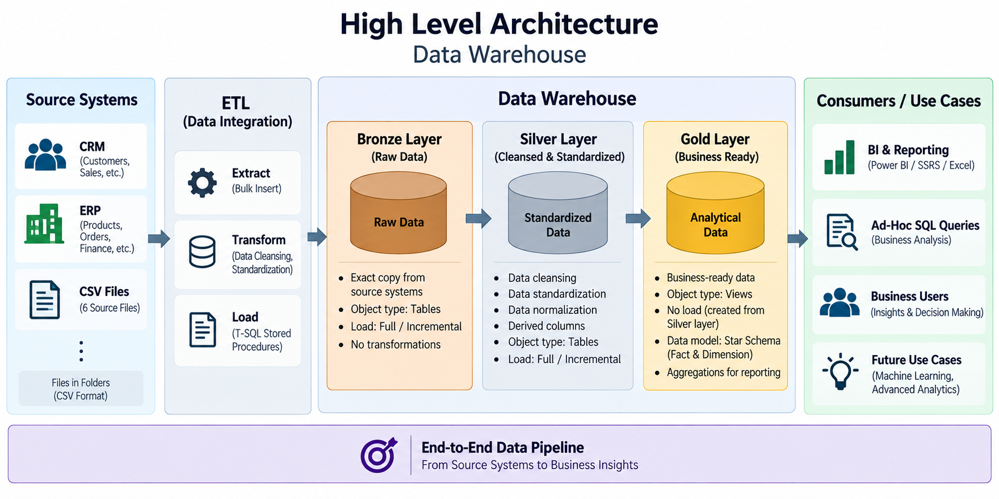

# 🏢 SQL Data Warehouse Project

Welcome to the **SQL Data Warehouse Project** repository! 🚀

This project demonstrates the end-to-end design and implementation of a modern **Microsoft SQL Server Data Warehouse** using industry-standard data engineering practices. It covers the complete data warehousing lifecycle, including data ingestion, ETL development, data transformation, dimensional modeling, data quality validation, and analytical reporting.

The primary objective of this project is to build a scalable and maintainable data warehouse that integrates data from multiple business systems into a centralized repository, enabling efficient reporting, analytics, and data-driven decision-making.

Whether you're learning SQL Server, exploring data warehousing concepts, or reviewing practical data engineering implementations, this repository provides a structured, real-world example of building a modern data warehouse solution.

---

# 🏗️ Data Architecture

This project follows the **Medallion Architecture**, organizing data into **Bronze**, **Silver**, and **Gold** layers.



### 🥉 Bronze Layer
Stores raw data extracted from CRM and ERP source systems without modifications. This layer preserves the original data for traceability and auditing.

### 🥈 Silver Layer
Cleanses, validates, standardizes, and transforms raw data into high-quality datasets suitable for downstream processing.

### 🥇 Gold Layer
Provides business-ready data modeled as a **Star Schema** consisting of dimension and fact views optimized for reporting, analytics, and business intelligence.

---

# 📖 Project Overview

This project demonstrates the complete development of a modern SQL Server Data Warehouse, including:

- Designing a Medallion Architecture (Bronze, Silver, Gold)
- Building ETL pipelines using SQL Server Stored Procedures
- Loading data from multiple source systems
- Performing data cleansing and validation
- Applying business transformation rules
- Creating Star Schema dimensional models
- Developing business-ready analytical views
- Implementing data quality validation
- Documenting architecture, naming conventions, and data models

This repository showcases practical skills commonly used in Data Engineering and Business Intelligence projects.

---

# 🚀 Project Requirements

## 🏗️ Data Warehouse Development

### Objective

Design and implement a scalable SQL Server Data Warehouse that consolidates data from multiple business systems into a centralized analytical repository.

### Specifications

- Import CRM and ERP datasets.
- Build ETL pipelines using Stored Procedures.
- Clean and standardize source data.
- Integrate multiple data sources.
- Design a dimensional data model.
- Maintain technical documentation.
- Validate data quality throughout the pipeline.

---

## 📊 Analytics & Business Intelligence

### Objective

Transform curated warehouse data into meaningful business insights that support reporting and strategic decision-making.

### Deliverables

- Customer Analysis
- Product Performance
- Sales Analysis
- Business KPIs
- Reporting-ready datasets
- Analytical SQL queries

---

# ⚙️ Technology Stack

| Category | Technologies |
|----------|--------------|
| Database | Microsoft SQL Server |
| Language | T-SQL |
| Architecture | Medallion Architecture |
| Data Modeling | Star Schema |
| ETL | Stored Procedures, BULK INSERT |
| Data Sources | CSV Files (CRM & ERP) |
| Documentation | Markdown |
| Diagramming | Draw.io |
| Version Control | Git & GitHub |

---

# 📂 Repository Structure

```text
sql-data-warehouse-project/
│
├── datasets/
│   ├── source_crm/
│   └── source_erp/
│
├── docs/
│   ├── ETL.png
│   ├── Project_Notes_Pictures.pdf
│   ├── data_architecture.png
│   ├── data_catalog.md
│   ├── data_flow.png
│   ├── data_integration.png
│   ├── data_layers.pdf
│   ├── data_model.png
│   └── naming_conventions.md
│
├── scripts/
│   ├── bronze/
│   │   ├── ddl_bronze.sql
│   │   └── proc_load_bronze.sql
│   │
│   ├── silver/
│   │   ├── ddl_silver.sql
│   │   ├── proc_load_silver.sql 
│   │   └── init_database.sql
│   │
│   └── gold/
│       └── ddl_gold.sql
│
├── tests/
│   ├── quality_checks_gold.sql
│   └── quality_checks_silver.sql
│
├── LICENSE
└── README.md
```

---

# 🚀 Getting Started

Follow these steps to run the project.

### 1. Clone the Repository

```bash
https://github.com/Mustaq7892/sql-data-warehouse-project
```

### 2. Create the Database

Execute:

```
scripts/silver/init_database.sql
```

### 3. Create Bronze Tables

Execute:

```
scripts/bronze/ddl_bronze.sql
```

### 4. Load Bronze Layer

Execute:

```
scripts/bronze/proc_load_bronze.sql
```

### 5. Create Silver Tables

Execute:

```
scripts/silver/ddl_silver.sql
```

### 6. Load Silver Layer

Execute:

```
scripts/silver/proc_load_silver.sql
```

### 7. Create Gold Views

Execute:

```
scripts/gold/ddl_gold.sql
```

### 8. Run Data Quality Checks

Execute:

```
tests/quality_checks_silver.sql
tests/quality_checks_gold.sql
```

---

# 📚 Project Documentation

The project includes detailed documentation covering every stage of the data warehouse development lifecycle.

| Document | Description |
|----------|-------------|
| Data Architecture | Overall Medallion Architecture |
| ETL Diagram | ETL process and workflow |
| Data Flow | End-to-end movement of data |
| Data Model | Star Schema design |
| Data Catalog | Business metadata for Gold layer |
| Naming Conventions | Standards for database objects |
| Quality Checks | Data validation scripts |

---

# ✨ Features

- End-to-End SQL Server Data Warehouse
- Medallion Architecture
- Bronze, Silver, Gold Layers
- ETL using Stored Procedures
- Data Cleansing & Standardization
- Data Quality Validation
- Star Schema Modeling
- Analytical SQL Views
- Enterprise Documentation
- Industry Best Practices

---

# 🛡️ License

project is licensed under the **MIT License**, allowing the code to be used, modified, and distributed in accordance with the terms of the license. See the [LICENSE](LICENSE) file for more information.

---

# 👨‍💻 About Me

Hi! I'm **Shaik Mustaq**, a **Software Developer** with over **2 years of professional experience** and a strong passion for **Data Engineering**, **SQL**, and **Database Technologies**.

I enjoy designing scalable data solutions, building modern data warehouses, and applying industry best practices to solve real-world business problems. This repository showcases my continuous learning journey and hands-on experience in SQL Server, ETL development, dimensional modeling, and data engineering.

I'm committed to continuously improving my technical expertise by building practical projects that demonstrate real-world implementations and industry-standard development practices.

## 🌐 Connect With Me

[](https://www.linkedin.com/in/shaik-mustaq-915741254/)

---
⭐ If you found this project helpful, consider giving it a **Star**. It helps others discover the project and supports my learning journey.
